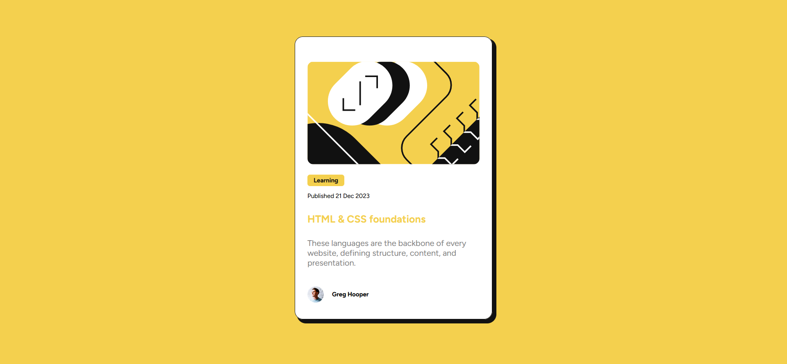

# Frontend Mentor - Blog Preview Card


## Welcome! 👋

# Frontend Mentor - Blog Preview Card Solution

This is a solution to the [Blog Preview Card challenge on Frontend Mentor](https://www.frontendmentor.io/challenges/blog-preview-card-ckPaj01IcS). Frontend Mentor challenges help you improve your coding skills by building realistic projects.

## Table of contents

- [Overview](#overview)
  - [The challenge](#the-challenge)
  - [Screenshot](#screenshot)
  - [Links](#links)
- [My process](#my-process)
  - [Built with](#built-with)
  - [What I learned](#what-i-learned)
  - [Useful resources](#useful-resources)
- [Author](#author)
- [Acknowledgments](#acknowledgments)

## Overview

### The challenge

Users should be able to:

- See hover and focus states for all interactive elements on the page.
- View the optimal layout depending on their device's screen size.

### Screenshot

## Desktop Preview


## Active State



## Mobile Preview


### Links

- Solution URL: https://github.com/DwarakanathAkkala/Blog-Preview-Card
- Live Site URL: https://blog-preview-card-dwaraka.netlify.app/

## My process

### Built with

- Semantic HTML5 markup
- CSS custom properties
- Flexbox
- CSS Grid
- Mobile-first workflow

### What I learned

```css
/* Box Shadow at right and bottom of the Card Component */

.proud-of-this-css {
  -webkit-box-shadow: 6px 6px 0px 2px hsl(0, 0%, 7%);
  -moz-box-shadow: 6px 6px 0px 2px hsl(0, 0%, 7%);
  box-shadow: 6px 6px 0px 2px hsl(0, 0%, 7%);
}
```

### Useful resources

- CSS Matic (https://www.cssmatic.com/box-shadow) - It is a Box Shadow generator which helped in required box-shadow css with good UI interaction.

## Author

- Website - [Dwarakanath](https://dwarakanath-akkala.netlify.app/)
- Frontend Mentor - [@DwarakanathAkkala](https://www.frontendmentor.io/profile/DwarakanathAkkala)
- Instagram - [@dwarakanath_akkala](https://www.instagram.com/dwarakanath_akkala/)
